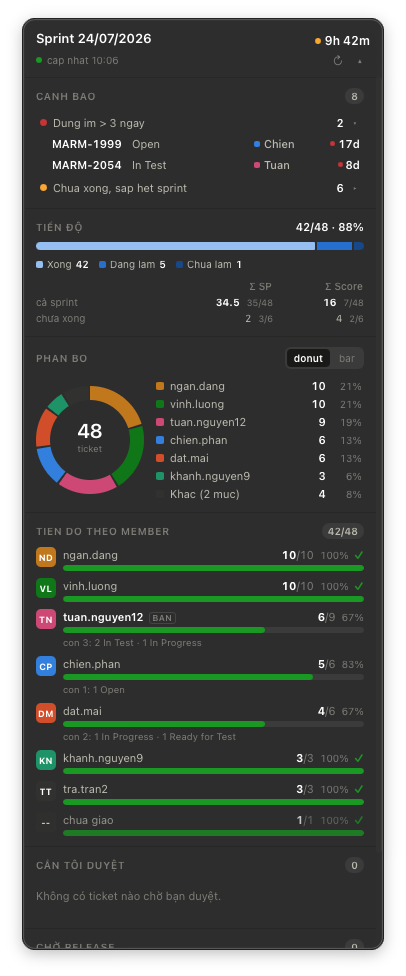

# Master Jira

Panel desktop nổi trên macOS, poll Jira mỗi 60 giây, hiển thị tình hình active sprint
của board bạn chỉ định trong cấu hình, cho vai trò leader.

Panel không ghi gì lên Jira — chỉ đọc.

<p align="center">
  
</p>

---

## Cài đặt bằng file .dmg (khuyên dùng)

Cách nhanh nhất — không cần cài Rust hay Node:

1. Tải `Master-Jira_x.y.z_aarch64.dmg` ở trang
   **[Releases](https://github.com/crisng95/jira-widget/releases)**.
2. Mở file `.dmg`, kéo **Master Jira** vào thư mục **Applications**.
3. App **chưa notarize** (không có tài khoản Apple Developer) nên macOS chặn ở lần
   mở đầu — trên macOS mới báo **"Master Jira is damaged and can't be opened"**.
   Đây **không** phải file hỏng. Sau khi kéo vào Applications, chạy một lần:

   ```bash
   xattr -dr com.apple.quarantine "/Applications/Master Jira.app"
   ```

   Lệnh này gỡ cờ "tải từ internet" để macOS thôi chặn; xong mở app bình thường.
   (Mẹo chuột phải → **Open** không còn hiệu lực cho thông báo "damaged" trên
   macOS 15+.)
4. Lần đầu chạy chưa có token thì cửa sổ **Cài đặt** tự mở. Nhập Jira URL và PAT,
   bấm **Kiểm tra kết nối** (vừa xác thực token vừa tự điền username), rồi
   **Tìm board** để chọn board. Cuối cùng **Lưu & khởi động lại**.

Token cất trong **macOS Keychain**, không nằm trong `config.toml`.

**Yêu cầu:** macOS trên Apple Silicon (arm64). Chưa có bản Intel/universal.

### macOS chặn app — hai cách mở, và vì sao

App được **ad-hoc signed** (chữ ký hợp lệ) nhưng **chưa notarize** — muốn notarize
phải có tài khoản Apple Developer ($99/năm). Không notarize thì macOS chặn mọi app
tải từ internet ở lần mở đầu. Thông báo tuỳ phiên bản macOS: `"is damaged and can't
be opened"` hoặc `"cannot be opened because the developer cannot be verified"`. Cả
hai đều **không** phải file hỏng. Hai cách qua:

- **Cách 1 — gỡ cờ quarantine (khuyên dùng, luôn được):**

  ```bash
  xattr -dr com.apple.quarantine "/Applications/Master Jira.app"
  ```

  Cờ quarantine là dấu "tải từ internet" macOS gắn vào; gỡ đi thì Gatekeeper thôi
  chặn. Chạy một lần rồi mở app bình thường.

- **Cách 2 — Open Anyway:** mở app một lần (bị chặn) → vào **System Settings →
  Privacy & Security**, kéo xuống mục báo app bị chặn, bấm **Open Anyway**, mở lại
  app. *Lưu ý:* cách này chỉ hiện với thông báo "cannot be verified"; nếu thấy
  "damaged" thì dùng Cách 1. Trên macOS 15+ mẹo chuột phải → **Open** không còn tác
  dụng cho ca "damaged".

**Muốn teammate double-click là chạy, không phải gõ gì:** phải **notarize** app —
cần Apple Developer account rồi ký Developer ID + `xcrun notarytool` trong lúc build.
Hiện chưa làm vì chưa có account; khi có thì ráp vào bước `yarn bundle`.

---

## Build từ source (cho dev)

### 1. Rust toolchain (một lần)

```bash
curl --proto '=https' --tlsv1.2 -sSf https://sh.rustup.rs | sh -s -- -y
source "$HOME/.cargo/env"
rustc --version && cargo --version
xcode-select --install    # nếu chưa có Command Line Tools
```

### 2. Dependencies

```bash
yarn install
```

### 3. Cài đặt qua UI (khuyên dùng)

Mở panel → icon trên **menu bar** → **Cài đặt…**

Cửa sổ cài đặt có tất cả: Jira URL, PAT, project key, **board picker** (bấm "Tìm board"
để chọn từ danh sách thay vì phải biết id), username của bạn, ngưỡng cảnh báo, status
map, tầng cửa sổ, thông báo.

Nút **"Kiểm tra kết nối"** vừa xác thực PAT vừa **tự điền username** của bạn — không phải
đi tra cứu username Jira của chính mình.

Lần đầu chạy mà chưa có token thì cửa sổ này **tự mở**.

Bấm **"Lưu & khởi động lại"** để áp dụng toàn bộ.

> **Đánh đổi bảo mật, nói thẳng:** ô nhập token trên UI nghĩa là PAT **có** đi qua webview
> một lần. Trước đây nó không bao giờ đi qua (chỉ có CLI đọc từ stdin). Giảm thiểu: ô là
> `type=password`, xoá khỏi bộ nhớ JS ngay sau khi gửi, không bao giờ đọc ngược ra UI
> (UI chỉ biết "đã có token" hay "chưa"), CSP chặn mọi kết nối ra ngoài từ webview, và
> token vào thẳng Keychain chứ không ghi ra `config.toml`. Muốn giữ tính chất cũ tuyệt đối
> thì dùng CLI `--set-token` ở dưới và không đụng ô đó.

### 3-alt. Nạp PAT bằng CLI (nếu không muốn token qua UI)

Panel dùng **PAT cá nhân**, không dùng token bot. Tạo PAT tại
`{JIRA_URL}` → avatar góc phải → **Profile** → **Personal Access Tokens** → *Create token*.

```bash
jira-widget --set-token
# dán PAT rồi Enter — token đọc từ stdin, không nằm trong `ps` hay history
```

Token cất trong macOS Keychain (service `jira-widget`, account `jira-pat`).
Xoá bằng `--clear-token`.

Thứ tự ưu tiên khi lấy token: biến môi trường `JIRA_WIDGET_TOKEN` → Keychain →
field `token` trong config.toml.

### 3b. Tìm board id bằng CLI

Jira không hiện board id ở bất kỳ đâu trên giao diện:

```bash
jira-widget --list-boards PROJ
```

```
  id       loai       ten
  1000     scrum      All items      <- điền số này vào board_id
  1001     scrum      Team board
  1002     kanban     Public items
```

### 4. Chạy

```bash
yarn start     # dev, hot reload
yarn bundle    # build .app + .dmg vào src-tauri/target/release/bundle/
```

Bản build xong kéo vào `/Applications`. Bật auto-start khi login từ menu tray.

---

## Cấu hình

`~/Library/Application Support/jira-widget/config.toml` — sinh tự động lần chạy
đầu, sửa xong khởi động lại app.

| Key | Mặc định | Ý nghĩa |
|---|---|---|
| `jira_url` | `https://jira.example.com` | Jira Server/DC |
| `project_key` | `"PROJ"` | Lọc issue theo project — một board có thể chứa issue của nhiều project. Để rỗng thì không lọc |
| `board_id` | `1000` | Board lấy sprint. Chưa biết số nào thì chạy `--list-boards` |
| `me` | `""` | Username Jira của bạn. Có giá trị thì: tô đậm dòng của bạn trong danh sách member, và hiện mục "Chờ tôi duyệt" (ticket bạn nằm trong Approvers `cf_10200` / QCs `cf_10201`). Để rỗng thì tắt hẳn |
| `poll_interval_secs` | `60` | Chu kỳ poll |
| `stale_days` | `3` | Quá ngần này ngày không ai động → cảnh báo đứng im |
| `ending_soon_hours` | `24` | Còn ít hơn ngần này giờ là "sắp hết sprint" |
| `old_age_days` | `30` | Ticket sống lâu hơn ngần này thì tô cảnh báo ở cột age |
| `review_statuses` | `["Ready for Review"]` | Status "Review" — đây là hàng đợi bàn giao |
| `pending_release_statuses` | `["Ready for Release"]` | Jira xếp là Done nhưng thực tế mới chờ release → tách riêng |
| `notify.*` | tất cả `true`, `group_threshold = 3` | Bật/tắt từng loại thông báo; quá 3 thay đổi thì gom làm một |
| `window_layer` | `"desktop"` | `desktop` = dán vào nền desktop, nằm dưới mọi cửa sổ app · `floating` = nổi trên tất cả |
| `display_mode` | `"team"` | `team` = cả sprint, mọi người · `only_me` = chỉ ticket của `me`. Đổi được nóng, không cần khởi động lại |

---

## Hai chế độ hiển thị: cả team ↔ chỉ việc của tôi

Panel mặc định là góc nhìn leader. Một member chuyển sang **Chỉ việc của tôi** để
cùng cái widget đó chỉ hiện ticket của mình.

Đổi ở ba chỗ, cùng một trạng thái:

- **Menu bar** → *Chi viec cua toi* (nhanh nhất)
- **Chip trên panel** — ở Only Me luôn hiện `● Tuan · chỉ việc của tôi`, bấm là về team
- **Cài đặt → Hiển thị** → *Panel hiện*

Đổi mode **không gọi lại Jira**: raw issue của lần fetch gần nhất được giữ lại và
snapshot được dựng lại từ đó, nên panel cập nhật ngay thay vì chờ hết chu kỳ 60 giây.
Số liệu vẫn mang mốc thời gian của lần fetch cũ chứ không nhích lên theo đồng hồ —
không có dữ liệu mới nào đứng sau nó cả.

Ở Only Me:

- Mọi con số (tiến độ, Σ SP/Score, cảnh báo đứng im, tuổi ticket) tính trên **tập
  đã lọc**, cộng một dòng bối cảnh `cả sprint 37/46 · 80%` để biết mình đứng ở đâu.
- **Ẩn** donut phân bổ và bảng tải member — một người thì hai thứ đó vô nghĩa.
- **Không ẩn** ba hàng đợi chờ test / chờ duyệt / chờ release. Chúng lọc theo **vai
  trò** (Approvers, QCs), không theo người làm: ticket chờ mình duyệt gần như luôn
  là việc của người khác, lọc theo assignee nữa thì chúng rỗng sạch đúng lúc cần nhất.
- **Thông báo vẫn chạy trên cả sprint.** Ticket bị đổi assignee sang người khác rơi
  khỏi màn hình Only Me đúng lúc nó thay đổi — đó lại là thứ cần báo nhất.
- Ticket **chưa giao ai** không thuộc về ai, nên không lọt vào Only Me của bất kỳ ai.
- Số cảnh báo trên menu bar cũng là **của riêng bạn** — badge khớp với panel.
  Đổi lại, lúc panel đang ẩn thì không có gì nhắc rằng màn hình đang bị lọc.

Chưa điền `me` thì Only Me bị khoá (item trên menu bar xám đi, radio trong Cài đặt
disabled). Sửa tay config thành `only_me` khi `me` rỗng thì app tự về `team` và ghi
log cảnh báo — không bao giờ hiện panel rỗng không giải thích.

---

## Panel nằm ở tầng nào

Mặc định `window_layer = "desktop"`: panel được ghim vào **tầng desktop** —
`NSWindow.level = kCGDesktopIconWindowLevel + 1` (= -2147483602), thấp hơn cửa sổ app
thường (level 0) rất xa. Hệ quả:

- **Không bao giờ che app khác.** Mở IDE/Chrome full-screen là panel biến mất sau lưng.
- Nhìn thấy khi desktop lộ ra, hoặc bấm `F11` / vuốt Mission Control.
- Ở trên icon desktop nên không bị icon che. Đổi lại, nếu anh để icon ở góc trên bên phải
  thì panel sẽ nằm đè lên chúng — kéo panel sang chỗ khác là xong, vị trí được nhớ.
- `collectionBehavior` = `CanJoinAllSpaces | Stationary | IgnoresCycle`: hiện ở mọi Space,
  đứng yên khi vào Mission Control, không nhảy vào vòng `Cmd+\``.

Tauri không có API cho việc này nên phần đó gọi thẳng NSWindow qua `objc2::msg_send!`
(`src-tauri/src/main.rs`, module `desktop_layer`), dùng `CGWindowLevelForKey` thay vì
hardcode con số.

**Lưu ý cần anh kiểm chứng:** cửa sổ ở tầng desktop có thể **không nhận được click**
trên một số cấu hình macOS — Finder nuốt sự kiện chuột trên vùng desktop. Nếu bấm vào
ticket mà không mở được Jira, đổi `window_layer = "floating"` rồi khởi động lại.

## Bảo mật

- **Token không bao giờ xuống webview.** Toàn bộ HTTP nằm ở Rust (`src-tauri/src/jira.rs`);
  frontend chỉ nhận `SprintSnapshot` đã tính sẵn qua event `panel://state`.
- Webview chỉ có capability `core:default`. Không có quyền network, không có quyền fs.
- `open_issue` từ chối mọi URL không bắt đầu bằng `jira_url` đã cấu hình — command này
  không phải cái cổng mở URL tuỳ ý.
- TLS verification **bật nghiêm ngặt**: cert của Jira do GlobalSign cấp, còn hạn tới
  01/2027, nên không cần `danger_accept_invalid_certs`.
- `.gitignore` chặn `config.toml`, `*.token`, `credentials/`, `.env*`.

Kiểm tra nhanh:

```bash
grep -rIiE "JIRAUSER|Bearer [A-Za-z0-9]{20}" src src-tauri/src
```

`--set-token` đọc PAT từ **stdin** chứ không nhận qua tham số dòng lệnh: tham số nằm
trong `ps` và trong history của shell, tức là lộ token cho mọi tiến trình khác trên máy.

---

## Kiến trúc

```
src-tauri/src/
  main.rs       bootstrap, tray, cửa sổ, command IPC
  jira.rs       HTTP client — NƠI DUY NHẤT chạm token và chạm mạng
  snapshot.rs   raw issues → SprintSnapshot; mọi con số trên panel tính ở đây
  diff.rs       so sánh 2 snapshot → danh sách thay đổi + gom notification
  poller.rs     vòng 60s + backoff 60s→2m→5m→10m
  config.rs     config.toml + Keychain
src/
  App.svelte    ghép các section
  lib/          Header, RiskAlerts, SprintProgress, Allocation, MemberLoadList,
                ReviewQueue, TicketRow
```

`snapshot.rs` và `diff.rs` là pure function (nhận `now` từ ngoài vào), test bằng
fixture đúng 9 ticket thật của Sprint 24/07/2026:

```bash
cd src-tauri && cargo test
```

## Log

`~/Library/Logs/jira-widget.log` — app mở bằng Finder thì stderr đi vào hư vô,
nên mọi thứ ghi ra file. Xem lỗi thật:

```bash
tail -f ~/Library/Logs/jira-widget.log
```

Bấm vào ticket sẽ ghi một dòng `mo ticket: <url>`. Không thấy dòng đó nghĩa là **click
chưa tới được cửa sổ** (xem phần tầng desktop ở trên), chứ không phải lỗi mở browser.

---

## Vài điều về dữ liệu Jira ảnh hưởng tới cách đọc panel

1. **`Target Start/End` và `duedate` rỗng 100%** trên toàn bộ ticket đang mở. Panel
   **không** tính quá hạn theo target date — nó dùng sprint end (24/07 19:50) và thời
   gian đứng im.

2. **Story point / app task score điền rất thưa** — SP có ở 5/9 ticket đang mở, app task
   score ở 3/9. Vì vậy panel **luôn** hiện mẫu số. Kiểu dữ liệu `PointScope` bắt buộc mang
   mẫu số nên UI không thể vô tình hiện tổng trần trụi.

   Panel hiện **hai phạm vi** cạnh nhau, ghi rõ bằng chữ — `cả sprint` (46 ticket) và
   `chưa xong` (9 ticket). Bản đầu chỉ có một con số tính trên ticket đang mở, đọc nhầm
   thành điểm cả sprint trong khi nó bỏ qua toàn bộ ticket đã đóng.

3. **`Ready for Release` bị Jira xếp `statusCategory = Done`.** Nghĩa là con số
   "37/46 done" gộp cả ticket mới chỉ chờ duyệt release. Panel tách riêng hai cái đó ở
   thanh tiến độ.

4. **Tiến độ theo member tính trên cả sprint, không chỉ việc còn tồn.** Đây từng là lỗi:
   `casey.park` làm 10 ticket — nhiều nhất sprint — nhưng đóng hết nên biến mất hoàn toàn
   khỏi panel. Giờ mỗi member hiện `done/total` + thanh tiến độ xanh, và ticket chưa giao
   ai gom thành một dòng riêng ở cuối.

   Donut cũng đổi theo: nó biểu diễn **tổng task cả sprint**, không phải số ticket còn tồn.
   Trước đây `alex.lee` hiện `44%` trong khi khối lượng thật là 9/46 = 20%.

Ngoài ra, cột phải của mục "Cần review" là **khoảng cách từ lần cập nhật gần nhất**,
không phải thời gian nằm trong trạng thái hiện tại. Muốn con số sau phải kéo changelog
từng ticket — đắt gấp nhiều lần cho một lần poll mỗi phút.

---

## Bảng màu

Lấy từ reference palette của skill `dataviz`, đã chạy `validate_palette.js`:

- **Categorical 6 slot** (định danh member, dùng cho donut + bar): PASS cả light lẫn dark.
  Worst adjacent CVD ΔE 9.1 light / 8.4 dark. Light mode có 3 hue dưới 3:1 contrast →
  áp dụng relief rule: legend luôn kèm direct label + số lượng, và danh sách member đóng
  vai trò table view.
- **Ordinal ramp 4 bậc** (ToDo → đang làm → chờ release → xong): 1 hue xanh, monotone,
  mỗi bước ΔL ≥ 0.06. PASS cả hai mode với bộ step riêng cho từng nền.
- **Status** (`good` / `warning` / `critical`): cố định, không theo theme, **luôn** đi kèm
  chấm màu + chữ nên không bao giờ phải đọc bằng màu đơn thuần. Bỏ hẳn slot `serious` vì
  nó chỉ cách `warning` ΔE 13.6 — dưới sàn 15.

Màu bám theo **người**: 6 người nhiều task nhất được vẽ riêng, màu gán theo alphabet
**trong nhóm 6 đó**; phần đuôi gộp thành "Khác" màu xám thay vì sinh hue thứ 7. Thứ hạng
chỉ quyết định *ai được hiện*, alphabet quyết định *màu nào* — nên đây không phải gán màu
theo thứ hạng. Đánh đổi: ai đó ra/vào nhóm top-6 thì màu có thể xê dịch một lần.

`shownMembers()` và `colorMap()` trong `src/types.ts` dùng chung một phép chọn, để không
tái diễn cảnh có người được vẽ trong donut nhưng không được cấp màu và render ra xám.
